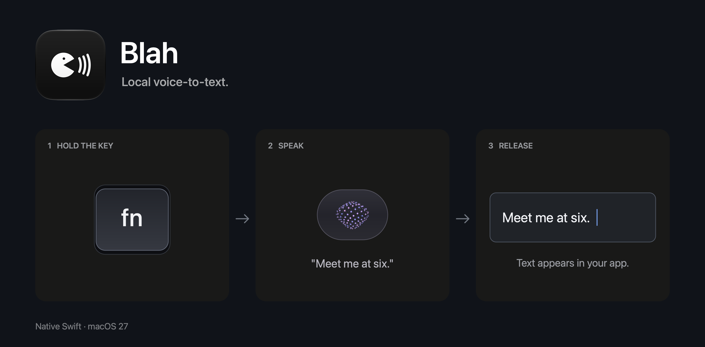

# Blah



A small native Swift dictation app for macOS 27, inspired by [Hex](https://github.com/kitlangton/Hex). Hold a key, speak, and paste the transcript into your app. Transcription and optional formatting run locally. This is a source-only project: build and sign your own copy.

> [!WARNING]
> This application was built entirely with gpt-6-astra. Use it at your own risk.

## Use

- Hold your dictation key to record. Release to transcribe and paste.
- Double-tap to record hands-free. Tap again to finish. Escape cancels.
- Left-click the menu bar icon to paste the last transcription or quit. Right-click for Settings.
- In General, click your dictation key and press a replacement. Letters, numbers, and standalone modifiers work too. Choose models, formatting, orb position, and launch at login there.
- Arrange microphones by priority. Blah uses the first available one, remembers disconnected microphones, and adds new ones at the bottom.
- Browse, search, and copy previous dictations in Transcript History, including the original text before formatting.

Enable Microphone, Input Monitoring, and Accessibility when prompted. The default key is Globe / Fn. Set "Press Globe key to" to "Do Nothing" in macOS Keyboard settings. A plain key such as P is reserved for dictation when pressed alone; combinations such as Command-P still work. Escape cancels key selection, and Caps Lock cannot be used for hold-to-dictate.

If formatting fails, Blah uses the original transcript. If it cannot paste, the transcript stays on the clipboard.

## Models

Download models in Settings → Models, then select them in General. Blah supports Parakeet Unified English, Parakeet v2, and multilingual Parakeet v3 for transcription. S1-mini by Superwhisper provides English formatting. Select Off to disable formatting.

Existing Hex models can be reused. The default folder is `~/Library/Application Support/voice-control/models`; choose another folder in Models if needed. Model weights are downloaded separately from the app. See [third-party notices](THIRD_PARTY_NOTICES.md) for the runtimes and model sources.

## History

Blah keeps the latest 2,000 transcripts. New entries replace the oldest when the limit is reached. Audio is not saved.

History is stored as JSONL at:

```text
~/Library/Application Support/Blah/history.jsonl
```

Use the file menu in Transcript History to open it or reveal it in Finder. You can edit entries or delete whole lines with a text editor. Save edits before dictating again.

## Build and sign

Requires an Apple silicon Mac, macOS 27, Xcode 27, CMake, Python 3, and OpenSSL available in your shell. Open Xcode once to finish its setup, then run from the cloned repository:

```sh
export DEVELOPER_DIR=/Applications/Xcode.app/Contents/Developer
./scripts/run.sh
```

This builds, signs, installs into `/Applications/Blah.app`, and launches it. Use `./scripts/build.sh` to build and sign without installing. Run the installed copy: launching from the project folder can cause macOS to hide the app's menu bar icon. The first build downloads and compiles the native inference libraries; later builds reuse them.

Signing is automatic. The first build creates your own self-signed development certificate in a private keychain under `~/Library/Application Support/Blah/Signing`. Later builds reuse it so privacy permissions can survive updates. Keep that directory private and intact. No paid Apple Developer account or notarization is needed for this local build. The scripts do not change system certificate trust or your default keychain.

## License

[MIT](LICENSE). See [third-party notices](THIRD_PARTY_NOTICES.md) for dependencies and model licenses.

## Why can't I just download the binary?

Because I'm not paying Apple $100 a year for this shit. That's what Developer ID signing and notarization would cost, even for a free app. I could ship an unnotarized binary, but you'd still have to deal with macOS security warnings.

Once the build tools above are installed, run `./scripts/run.sh` and you have the app ready. You also get all the source code, so you can see what it does and change whatever you want.
